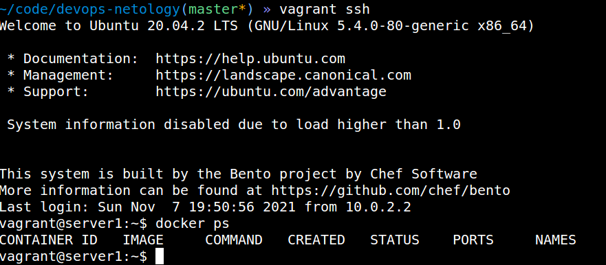

# Домашнее задание к занятию "5.2. Применение принципов IaaC в работе с виртуальными машинами"

## Как сдавать задания

Обязательными к выполнению являются задачи без указания звездочки. Их выполнение необходимо для получения зачета и диплома о профессиональной переподготовке.

Задачи со звездочкой (*) являются дополнительными задачами и/или задачами повышенной сложности. Они не являются обязательными к выполнению, но помогут вам глубже понять тему.

Домашнее задание выполните в файле readme.md в github репозитории. В личном кабинете отправьте на проверку ссылку на .md-файл в вашем репозитории.

Любые вопросы по решению задач задавайте в чате учебной группы.

---

## Задача 1

- Опишите своими словами основные преимущества применения на практике IaaC паттернов.

**Ответ:**
- Уменьшает такую метрику как TimeToMarket, уменьшает время доставки продукта пользователям, засчет оптимизации развертывания инфраструктуры.
- Повторяемость окружения
- Возможность откатиться на предыдущую версию
- автоматизирует процесс предоставления инфраструктуры для разработки, тестирования
- стабильность среды
- Вся инфраструктура для выполнения приложения у разработчика и у инженера на каком-то окружении воспроизводиться единообразно.
---

- Какой из принципов IaaC является основополагающим?

**Ответ:**
- Идемпотентность, сколько бы не было повторных операции, результат должен быть один и тот же
---

## Задача 2

- Чем Ansible выгодно отличается от других систем управление конфигурациями?

**Ответ:**
- не нужны агенты, достаточно ssh
- простой, декларативный подход
- много модулей
---

- Какой, на ваш взгляд, метод работы систем конфигурации более надёжный push или pull?

**Ответ:**

pull надежнее, т.к. все изменения затягиваются агентом, установленным на каждом сервере.
Это дает возможность по расписанию ходить и обновлять конфигурацию, не нагружая централизованный сервер обновленениями для тысяч серверов.

Второй момент, если разработчики меняют что-то в конфигурации сервера, то через какое-то время конфигурация восстановится на верную.
Позволяет избежать дрейф инфраструктуры.

---

## Задача 3

Установить на личный компьютер:

- VirtualBox
- Vagrant
- Ansible

*Приложить вывод команд установленных версий каждой из программ, оформленный в markdown.*

---

---


## Задача 4 (*)

Воспроизвести практическую часть лекции самостоятельно.

- Создать виртуальную машину.
- Зайти внутрь ВМ, убедиться, что Docker установлен с помощью команды
```
docker ps
```
---

---
