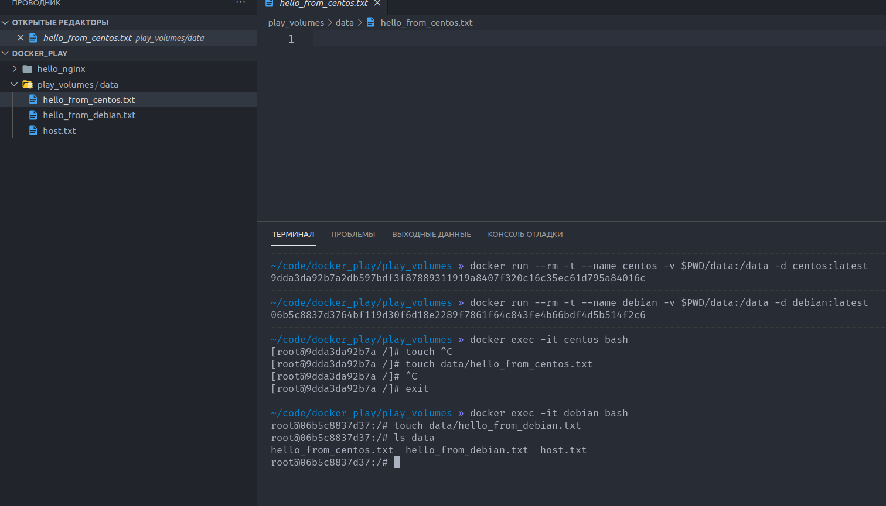

# Домашнее задание к занятию "5.3. Введение. Экосистема. Архитектура. Жизненный цикл Docker контейнера"

---

## Задача 1

Сценарий выполения задачи:

- создайте свой репозиторий на https://hub.docker.com;
- выберете любой образ, который содержит веб-сервер Nginx;
- создайте свой fork образа;
- реализуйте функциональность:
запуск веб-сервера в фоне с индекс-страницей, содержащей HTML-код ниже:
```
<html>
<head>
Hey, Netology
</head>
<body>
<h1>I’m DevOps Engineer!</h1>
</body>
</html>
```


---
**Ответ**:

[nginx-image](https://hub.docker.com/r/buurz/hello_nginx/tags)

---

## Задача 2

Посмотрите на сценарий ниже и ответьте на вопрос:
"Подходит ли в этом сценарии использование Docker контейнеров или лучше подойдет виртуальная машина, физическая машина? Может быть возможны разные варианты?"

Детально опишите и обоснуйте свой выбор.

--

Сценарий:
<details>
<summary>Высоконагруженное монолитное java веб-приложение;</summary>

  **Докер не подойдет, он никак не облегчит доставку монолита, нет зависимостей. Плюс докер использует столько ресурсов, сколько планировщик ядра хоста позволит. Если по памяти будет плохо, то возможно будет отстреливать процессы и попадет в докер демон. Добавляет оверхед в данном случае по ресурсам. Подойдет физ.машина**

</details>

<details>
<summary> Nodejs веб-приложение;</summary>

**Докер подойдет, упакует нужные зависимости, можно удобно скейлить, однако если приложение маленькое и простое, то это того не стоит, подойдет виртуалка**
</details>

<details>

<summary>Мобильное приложение c версиями для Android и iOS;
</summary>

  **Докер не подойдет, не работает с GUI, не работает с этими ОС**
</details>

<details>
<summary>Шина данных на базе Apache Kafka;</summary>

**Докер подойдет, можно проверить всю инфру локально каждому разработчику и на тестовых стендах**

</details>

<details>
<summary>Elasticsearch кластер для реализации логирования продуктивного веб-приложения - три ноды elasticsearch, два logstash и две ноды kibana;
</summary>

**Докер подойдет для кластеризации, обеспечит доставку сервисов, скейлинг.**

</details>

<details>
<summary>Мониторинг-стек на базе Prometheus и Grafana;</summary>

  **Докер подойдет для возможного упрощения инсталяции, но смысла особового нет. Плюс node_exporter скорее всего надо ставить вне докера, т.к. снимает метрики с ядра**

</details>

<details>
<summary>MongoDB, как основное хранилище данных для java-приложения;</summary>

**Не вижу преимущества докера, т.к. специфичных требований нет, можно брать хранилище как сервис и не заморачиваться. Если нужно кастомное что-то, то брать можно виртуалку. Хоть образ для монги и есть, скорее нужен для разработки и тестовых средств**

</details>

<details>
<summary>Gitlab сервер для реализации CI/CD процессов и приватный (закрытый) Docker Registry.</summary>

**Возможно докер удобней при инсталяции, но в остальном сервер не нужно скейлить или как-постоянно обновлять/откатывать. В итоге скорее нет, чем да. Также можно поставить на виртуалку**

</details>

&nbsp;

*PS: пока читал более подробно про контейнерезацию, наткнулся на решение Podman, Buildah. Хотелось бы на будущих лекциях узнать и про эту альтернативу =)*

## Задача 3

- Запустите первый контейнер из образа ***centos*** c любым тэгом в фоновом
режиме, подключив папку ```/data``` из текущей рабочей директории на хостовой машине в ```/data``` контейнера;
- Запустите второй контейнер из образа ***debian*** в фоновом режиме, подключив папку ```/data``` из текущей рабочей директории на хостовой машине в ```/data``` контейнера;
- Подключитесь к первому контейнеру с помощью ```docker exec``` и создайте текстовый файл любого содержания в ```/data```;
- Добавьте еще один файл в папку ```/data``` на хостовой машине;
- Подключитесь во второй контейнер и отобразите листинг и содержание файлов в ```/data``` контейнера.

---
**Ответ:**



---

## Задача 4 (*)

Воспроизвести практическую часть лекции самостоятельно.

Соберите Docker образ с Ansible, загрузите на Docker Hub и пришлите ссылку вместе с остальными ответами к задачам.

---
**Ответ**:

[ansible-image](https://hub.docker.com/r/buurz/ansible/tags)

---
