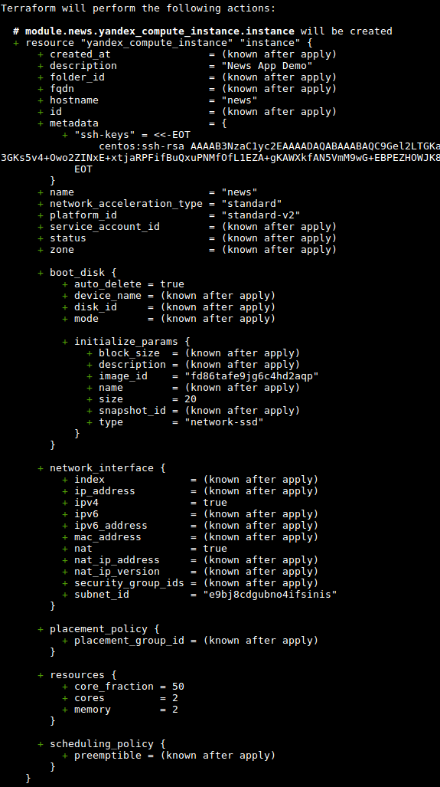

# [Домашнее задание к занятию "7.2. Облачные провайдеры и синтаксис Terraform."](https://github.com/netology-code/virt-homeworks/blob/master/07-terraform-02-syntax/README.md)

В качестве результата задания предоставьте:
1. Ответ на вопрос: при помощи какого инструмента (из разобранных на прошлом занятии) можно создать свой образ ami?
1. Ссылку на репозиторий с исходной конфигурацией терраформа.

---
**Ответ**


Создать свой образ можно с помощью Packer.

Переменные yc_cloud / yc_cloud_id был заданы через окружение.

terraform plan


```


```

---
