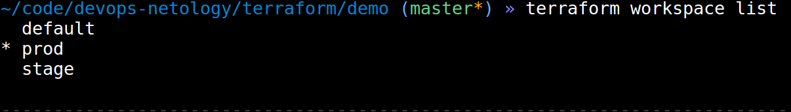

В виде результата работы пришлите:

    Вывод команды terraform workspace list.
    Вывод команды terraform plan для воркспейса prod.


---




```plain
~/code/devops-netology/terraform/demo (master*) » terraform plan                                              buurz@buurz-OMEN

Terraform used the selected providers to generate the following execution plan. Resource actions are indicated with the
following symbols:
  + create

Terraform will perform the following actions:

  # module.feed["prod"].yandex_compute_instance.instance[0] will be created
  + resource "yandex_compute_instance" "instance" {
      + created_at                = (known after apply)
      + description               = "Feed"
      + folder_id                 = (known after apply)
      + fqdn                      = (known after apply)
      + hostname                  = "feed-1"
      + id                        = (known after apply)
      + metadata                  = {
          + "ssh-keys" = <<-EOT
                centos:ssh-rsa AAAAB3NzaC1yc2EAAAADAQABAAABAQC9Gel2LTGKaZD4Np8isi1F5oNUxXmbcL1rF/5RUrSvLI68scytxHIiBzcV7Cvs0tfToSoLalK472a/Vtylm+TOaMaogNOkTv43hBtgNwcts9DgceZfLK19lVQjFvP2dlo/xwRaWUr6+8N44mXvJV+qe6+d5hwHC7HeBAuefwNl1LwonOIdyZWjaFtLyZ7aOJt3GKs5v4+Owo2ZINxE+xtjaRPFifBuQxuPNMfOfL1EZA+gKAWXkfAN5VmM9wG+EBPEZHOWJK8PHB2XyeDb9jaiodusP/xBX/32bGIXfhRwOSGIxYdspt+BIBLvzqNuvfFE45quiB316zyHpYWuSljJ buurz@buurz-OMEN
            EOT
        }
      + name                      = "feed-1"
      + network_acceleration_type = "standard"
      + platform_id               = "standard-v2"
      + service_account_id        = (known after apply)
      + status                    = (known after apply)
      + zone                      = (known after apply)

      + boot_disk {
          + auto_delete = true
          + device_name = (known after apply)
          + disk_id     = (known after apply)
          + mode        = (known after apply)

          + initialize_params {
              + block_size  = (known after apply)
              + description = (known after apply)
              + image_id    = "fd86tafe9jg6c4hd2aqp"
              + name        = (known after apply)
              + size        = 40
              + snapshot_id = (known after apply)
              + type        = "network-ssd"
            }
        }

      + network_interface {
          + index              = (known after apply)
          + ip_address         = (known after apply)
          + ipv4               = true
          + ipv6               = (known after apply)
          + ipv6_address       = (known after apply)
          + mac_address        = (known after apply)
          + nat                = true
          + nat_ip_address     = (known after apply)
          + nat_ip_version     = (known after apply)
          + security_group_ids = (known after apply)
          + subnet_id          = "e9bj8cdgubno4ifsinis"
        }

      + placement_policy {
          + placement_group_id = (known after apply)
        }

      + resources {
          + core_fraction = 50
          + cores         = 2
          + memory        = 2
        }

      + scheduling_policy {
          + preemptible = (known after apply)
        }
    }

  # module.feed["prod"].yandex_compute_instance.instance[1] will be created
  + resource "yandex_compute_instance" "instance" {
      + created_at                = (known after apply)
      + description               = "Feed"
      + folder_id                 = (known after apply)
      + fqdn                      = (known after apply)
      + hostname                  = "feed-2"
      + id                        = (known after apply)
      + metadata                  = {
          + "ssh-keys" = <<-EOT
                centos:ssh-rsa AAAAB3NzaC1yc2EAAAADAQABAAABAQC9Gel2LTGKaZD4Np8isi1F5oNUxXmbcL1rF/5RUrSvLI68scytxHIiBzcV7Cvs0tfToSoLalK472a/Vtylm+TOaMaogNOkTv43hBtgNwcts9DgceZfLK19lVQjFvP2dlo/xwRaWUr6+8N44mXvJV+qe6+d5hwHC7HeBAuefwNl1LwonOIdyZWjaFtLyZ7aOJt3GKs5v4+Owo2ZINxE+xtjaRPFifBuQxuPNMfOfL1EZA+gKAWXkfAN5VmM9wG+EBPEZHOWJK8PHB2XyeDb9jaiodusP/xBX/32bGIXfhRwOSGIxYdspt+BIBLvzqNuvfFE45quiB316zyHpYWuSljJ buurz@buurz-OMEN
            EOT
        }
      + name                      = "feed-2"
      + network_acceleration_type = "standard"
      + platform_id               = "standard-v2"
      + service_account_id        = (known after apply)
      + status                    = (known after apply)
      + zone                      = (known after apply)

      + boot_disk {
          + auto_delete = true
          + device_name = (known after apply)
          + disk_id     = (known after apply)
          + mode        = (known after apply)

          + initialize_params {
              + block_size  = (known after apply)
              + description = (known after apply)
              + image_id    = "fd86tafe9jg6c4hd2aqp"
              + name        = (known after apply)
              + size        = 40
              + snapshot_id = (known after apply)
              + type        = "network-ssd"
            }
        }

      + network_interface {
          + index              = (known after apply)
          + ip_address         = (known after apply)
          + ipv4               = true
          + ipv6               = (known after apply)
          + ipv6_address       = (known after apply)
          + mac_address        = (known after apply)
          + nat                = true
          + nat_ip_address     = (known after apply)
          + nat_ip_version     = (known after apply)
          + security_group_ids = (known after apply)
          + subnet_id          = "e9bj8cdgubno4ifsinis"
        }

      + placement_policy {
          + placement_group_id = (known after apply)
        }

      + resources {
          + core_fraction = 50
          + cores         = 2
          + memory        = 2
        }

      + scheduling_policy {
          + preemptible = (known after apply)
        }
    }

  # module.news.yandex_compute_instance.instance[0] will be created
  + resource "yandex_compute_instance" "instance" {
      + created_at                = (known after apply)
      + description               = "News App Demo"
      + folder_id                 = (known after apply)
      + fqdn                      = (known after apply)
      + hostname                  = "news-1"
      + id                        = (known after apply)
      + metadata                  = {
          + "ssh-keys" = <<-EOT
                centos:ssh-rsa AAAAB3NzaC1yc2EAAAADAQABAAABAQC9Gel2LTGKaZD4Np8isi1F5oNUxXmbcL1rF/5RUrSvLI68scytxHIiBzcV7Cvs0tfToSoLalK472a/Vtylm+TOaMaogNOkTv43hBtgNwcts9DgceZfLK19lVQjFvP2dlo/xwRaWUr6+8N44mXvJV+qe6+d5hwHC7HeBAuefwNl1LwonOIdyZWjaFtLyZ7aOJt3GKs5v4+Owo2ZINxE+xtjaRPFifBuQxuPNMfOfL1EZA+gKAWXkfAN5VmM9wG+EBPEZHOWJK8PHB2XyeDb9jaiodusP/xBX/32bGIXfhRwOSGIxYdspt+BIBLvzqNuvfFE45quiB316zyHpYWuSljJ buurz@buurz-OMEN
            EOT
        }
      + name                      = "news-1"
      + network_acceleration_type = "standard"
      + platform_id               = "standard-v2"
      + service_account_id        = (known after apply)
      + status                    = (known after apply)
      + zone                      = (known after apply)

      + boot_disk {
          + auto_delete = true
          + device_name = (known after apply)
          + disk_id     = (known after apply)
          + mode        = (known after apply)

          + initialize_params {
              + block_size  = (known after apply)
              + description = (known after apply)
              + image_id    = "fd86tafe9jg6c4hd2aqp"
              + name        = (known after apply)
              + size        = 40
              + snapshot_id = (known after apply)
              + type        = "network-ssd"
            }
        }

      + network_interface {
          + index              = (known after apply)
          + ip_address         = (known after apply)
          + ipv4               = true
          + ipv6               = (known after apply)
          + ipv6_address       = (known after apply)
          + mac_address        = (known after apply)
          + nat                = true
          + nat_ip_address     = (known after apply)
          + nat_ip_version     = (known after apply)
          + security_group_ids = (known after apply)
          + subnet_id          = "e9bj8cdgubno4ifsinis"
        }

      + placement_policy {
          + placement_group_id = (known after apply)
        }

      + resources {
          + core_fraction = 50
          + cores         = 2
          + memory        = 2
        }

      + scheduling_policy {
          + preemptible = (known after apply)
        }
    }

  # module.news.yandex_compute_instance.instance[1] will be created
  + resource "yandex_compute_instance" "instance" {
      + created_at                = (known after apply)
      + description               = "News App Demo"
      + folder_id                 = (known after apply)
      + fqdn                      = (known after apply)
      + hostname                  = "news-2"
      + id                        = (known after apply)
      + metadata                  = {
          + "ssh-keys" = <<-EOT
                centos:ssh-rsa AAAAB3NzaC1yc2EAAAADAQABAAABAQC9Gel2LTGKaZD4Np8isi1F5oNUxXmbcL1rF/5RUrSvLI68scytxHIiBzcV7Cvs0tfToSoLalK472a/Vtylm+TOaMaogNOkTv43hBtgNwcts9DgceZfLK19lVQjFvP2dlo/xwRaWUr6+8N44mXvJV+qe6+d5hwHC7HeBAuefwNl1LwonOIdyZWjaFtLyZ7aOJt3GKs5v4+Owo2ZINxE+xtjaRPFifBuQxuPNMfOfL1EZA+gKAWXkfAN5VmM9wG+EBPEZHOWJK8PHB2XyeDb9jaiodusP/xBX/32bGIXfhRwOSGIxYdspt+BIBLvzqNuvfFE45quiB316zyHpYWuSljJ buurz@buurz-OMEN
            EOT
        }
      + name                      = "news-2"
      + network_acceleration_type = "standard"
      + platform_id               = "standard-v2"
      + service_account_id        = (known after apply)
      + status                    = (known after apply)
      + zone                      = (known after apply)

      + boot_disk {
          + auto_delete = true
          + device_name = (known after apply)
          + disk_id     = (known after apply)
          + mode        = (known after apply)

          + initialize_params {
              + block_size  = (known after apply)
              + description = (known after apply)
              + image_id    = "fd86tafe9jg6c4hd2aqp"
              + name        = (known after apply)
              + size        = 40
              + snapshot_id = (known after apply)
              + type        = "network-ssd"
            }
        }

      + network_interface {
          + index              = (known after apply)
          + ip_address         = (known after apply)
          + ipv4               = true
          + ipv6               = (known after apply)
          + ipv6_address       = (known after apply)
          + mac_address        = (known after apply)
          + nat                = true
          + nat_ip_address     = (known after apply)
          + nat_ip_version     = (known after apply)
          + security_group_ids = (known after apply)
          + subnet_id          = "e9bj8cdgubno4ifsinis"
        }

      + placement_policy {
          + placement_group_id = (known after apply)
        }

      + resources {
          + core_fraction = 50
          + cores         = 2
          + memory        = 2
        }

      + scheduling_policy {
          + preemptible = (known after apply)
        }
    }

Plan: 4 to add, 0 to change, 0 to destroy.

──────────────────────────────────────────────────────────────────────────────────────────────────────────────────────────────


```
---
