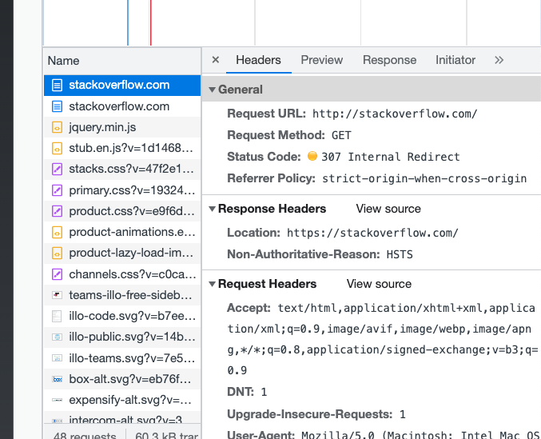

# Домашнее задание к занятию "3.6. Компьютерные сети, лекция 1"

1. Работа c HTTP через телнет.
- Подключитесь утилитой телнет к сайту stackoverflow.com
`telnet stackoverflow.com 80`
- отправьте HTTP запрос
```bash
GET /questions HTTP/1.0
HOST: stackoverflow.com
[press enter]
[press enter]
```
- В ответе укажите полученный HTTP код, что он означает?

    **Пришел код 301, редирект на https**

        vagrant@vagrant:~$ telnet stackoverflow.com 80
        Trying 151.101.1.69...
        Connected to stackoverflow.com.
        Escape character is '^]'.
        GET /questions HTTP/1.0
        HOST: stackoverflow.com

        HTTP/1.1 301 Moved Permanently
        cache-control: no-cache, no-store, must-revalidate
        location: https://stackoverflow.com/questions
        x-request-guid: a489908f-2520-4c6c-b8d4-3d2b8dbf6e6c
        feature-policy: microphone 'none'; speaker 'none'
        content-security-policy: upgrade-insecure-requests; frame-ancestors 'self' https://stackexchange.com
        Accept-Ranges: bytes
        Date: Sat, 25 Sep 2021 14:49:23 GMT
        Via: 1.1 varnish
        Connection: close
        X-Served-By: cache-fra19174-FRA
        X-Cache: MISS
        X-Cache-Hits: 0
        X-Timer: S1632581363.370146,VS0,VE85
        Vary: Fastly-SSL
        X-DNS-Prefetch-Control: off
        Set-Cookie: prov=8d41bf6e-1680-2ec3-866f-b4d1b6977082; domain=.stackoverflow.com; expires=Fri, 01-Jan-2055 00:00:00 GMT; path=/; HttpOnly

2. Повторите задание 1 в браузере, используя консоль разработчика F12.
- откройте вкладку `Network`
- отправьте запрос http://stackoverflow.com
- найдите первый ответ HTTP сервера, откройте вкладку `Headers`
- укажите в ответе полученный HTTP код.

        ответ 307, внутренний редирект

    
- проверьте время загрузки страницы, какой запрос обрабатывался дольше всего?
- приложите скриншот консоли браузера в ответ.

   

3. Какой IP адрес у вас в интернете?

        vagrant@vagrant:~$ curl https://icanhazip.com
        176.52.xx.xx

4. Какому провайдеру принадлежит ваш IP адрес? Какой автономной системе AS? Воспользуйтесь утилитой `whois`

        vagrant@vagrant:~$ whois 176.52.xx.xx | grep 'org-name\|origin'
        org-name:       MTS PJSC
        origin:         AS29194

5. Через какие сети проходит пакет, отправленный с вашего компьютера на адрес 8.8.8.8? Через какие AS? Воспользуйтесь утилитой `traceroute`

        traceroute -nA 8.8.8.8

        [AS29194]
        [AS8359]
        [AS15169]


6. Повторите задание 5 в утилите `mtr`. На каком участке наибольшая задержка - delay?

        Дольше всех 30 хоп от Гугла


        vagrant@vagrant:~$ mtr 8.8.8.8 -znrc 1
        Start: 2021-09-25T15:54:19+0000
        HOST: vagrant                     Loss%   Snt   Last   Avg  Best  Wrst StDev
        1. AS???    10.0.2.2             0.0%     1    0.3   0.3   0.3   0.3   0.0
        2. AS???    192.168.0.1          0.0%     1   30.4  30.4  30.4  30.4   0.0
        3. AS31286  217.173.22.0         0.0%     1   19.6  19.6  19.6  19.6   0.0
        4. AS???    10.218.2.53          0.0%     1    3.8   3.8   3.8   3.8   0.0
        5. AS???    10.218.1.177         0.0%     1   65.4  65.4  65.4  65.4   0.0
        6. AS8359   212.188.23.244       0.0%     1   43.4  43.4  43.4  43.4   0.0
        7. AS???    ???                 100.0     1    0.0   0.0   0.0   0.0   0.0
        8. AS8359   195.34.50.161        0.0%     1   53.9  53.9  53.9  53.9   0.0
        9. AS8359   212.188.29.82        0.0%     1   32.6  32.6  32.6  32.6   0.0
        10. AS15169  108.170.250.130      0.0%     1   20.3  20.3  20.3  20.3   0.0
        11. AS15169  209.85.255.136       0.0%     1   78.6  78.6  78.6  78.6   0.0
        12. AS15169  209.85.254.20        0.0%     1   64.3  64.3  64.3  64.3   0.0
        13. AS15169  216.239.49.113       0.0%     1   94.5  94.5  94.5  94.5   0.0
        14. AS???    ???                 100.0     1    0.0   0.0   0.0   0.0   0.0
        15. AS???    ???                 100.0     1    0.0   0.0   0.0   0.0   0.0
        16. AS???    ???                 100.0     1    0.0   0.0   0.0   0.0   0.0
        17. AS???    ???                 100.0     1    0.0   0.0   0.0   0.0   0.0
        18. AS???    ???                 100.0     1    0.0   0.0   0.0   0.0   0.0
        19. AS???    ???                 100.0     1    0.0   0.0   0.0   0.0   0.0
        20. AS???    ???                 100.0     1    0.0   0.0   0.0   0.0   0.0
        21. AS???    ???                 100.0     1    0.0   0.0   0.0   0.0   0.0
        22. AS???    ???                 100.0     1    0.0   0.0   0.0   0.0   0.0
        23. AS15169  8.8.8.8              0.0%     1  174.9 174.9 174.9 174.9   0.0

7. Какие DNS сервера отвечают за доменное имя dns.google? Какие A записи? воспользуйтесь утилитой `dig`

        vagrant@vagrant:~$ dig dns.google +noall +answer
        dns.google.		2895	IN	A	8.8.8.8
        dns.google.		2895	IN	A	8.8.4.4
        vagrant@vagrant:~$ dig dns.google NS +noall +answer
        dns.google.		7017	IN	NS	ns1.zdns.google.
        dns.google.		7017	IN	NS	ns3.zdns.google.
        dns.google.		7017	IN	NS	ns4.zdns.google.
        dns.google.		7017	IN	NS	ns2.zdns.google.

8. Проверьте PTR записи для IP адресов из задания 7. Какое доменное имя привязано к IP? воспользуйтесь утилитой `dig`

        vagrant@vagrant:~$ dig -x 8.8.4.4 | grep arpa
        ;4.4.8.8.in-addr.arpa.		IN	PTR
        4.4.8.8.in-addr.arpa.	7148	IN	PTR	dns.google.

        vagrant@vagrant:~$ dig -x 8.8.8.8 | grep arpa
        ;8.8.8.8.in-addr.arpa.		IN	PTR
        8.8.8.8.in-addr.arpa.	5657	IN	PTR	dns.google.