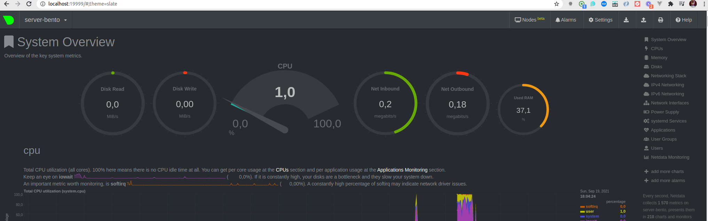

# Домашнее задание к занятию "3.4. Операционные системы, лекция 2"

1. На лекции мы познакомились с [node_exporter](https://github.com/prometheus/node_exporter/releases). В демонстрации его исполняемый файл запускался в background. Этого достаточно для демо, но не для настоящей production-системы, где процессы должны находиться под внешним управлением. Используя знания из лекции по systemd, создайте самостоятельно простой [unit-файл](https://www.freedesktop.org/software/systemd/man/systemd.service.html) для node_exporter:

    * поместите его в автозагрузку,
    * предусмотрите возможность добавления опций к запускаемому процессу через внешний файл (посмотрите, например, на `systemctl cat cron`),
    * удостоверьтесь, что с помощью systemctl процесс корректно стартует, завершается, а после перезагрузки автоматически поднимается.

            root@server-bento:/home# systemctl status node_exporter.service
            ● node_exporter.service - Prometheus Node Exporter
                Loaded: loaded (/etc/systemd/system/node_exporter.service; enabled; vendor preset: enabled)
                Active: active (running) since Sun 2021-09-19 14:49:05 UTC; 51s ago
            Main PID: 4919 (node_exporter)
                Tasks: 3 (limit: 532)
                Memory: 1.5M
                CGroup: /system.slice/node_exporter.service
                        └─4919 /usr/local/bin/node_exporter


1. Ознакомьтесь с опциями node_exporter и выводом `/metrics` по-умолчанию. Приведите несколько опций, которые вы бы выбрали для базового мониторинга хоста по CPU, памяти, диску и сети.

        node_cpu_seconds_total
        node_filesystem_avail_bytes
        node_network_receive_bytes_total
        node_memory_usage_bytes


1. Установите в свою виртуальную машину [Netdata](https://github.com/netdata/netdata). Воспользуйтесь [готовыми пакетами](https://packagecloud.io/netdata/netdata/install) для установки (`sudo apt install -y netdata`). После успешной установки:
    * в конфигурационном файле `/etc/netdata/netdata.conf` в секции [web] замените значение с localhost на `bind to = 0.0.0.0`,
    * добавьте в Vagrantfile проброс порта Netdata на свой локальный компьютер и сделайте `vagrant reload`:

    ```bash
    config.vm.network "forwarded_port", guest: 19999, host: 19999
    ```

    После успешной перезагрузки в браузере *на своем ПК* (не в виртуальной машине) вы должны суметь зайти на `localhost:19999`. Ознакомьтесь с метриками, которые по умолчанию собираются Netdata и с комментариями, которые даны к этим метрикам.

    


1. Можно ли по выводу `dmesg` понять, осознает ли ОС, что загружена не на настоящем оборудовании, а на системе виртуализации?

        [    0.002610] CPU MTRRs all blank - virtualized system.
        [    0.051295] Booting paravirtualized kernel on KVM
        [    5.254210] systemd[1]: Detected virtualization oracle.

1. Как настроен sysctl `fs.nr_open` на системе по-умолчанию? Узнайте, что означает этот параметр. Какой другой существующий лимит не позволит достичь такого числа (`ulimit --help`)?

        максимальное количество файловых дескрипторов, которые может открыть процесс

        vagrant@server-bento:~$ sysctl -n fs.nr_open
        1048576

        Значение "Max open files"(ulimit -n) ограничено fs.nr_open value

        $ ulimit -n
        1024


1. Запустите любой долгоживущий процесс (не `ls`, который отработает мгновенно, а, например, `sleep 1h`) в отдельном неймспейсе процессов; покажите, что ваш процесс работает под PID 1 через `nsenter`. Для простоты работайте в данном задании под root (`sudo -i`). Под обычным пользователем требуются дополнительные опции (`--map-root-user`) и т.д.

        root@server-bento:/# ps aux
        USER         PID %CPU %MEM    VSZ   RSS TTY      STAT START   TIME COMMAND
        root           1  0.0  0.1   7228   532 pts/1    S+   15:59   0:00 sleep 1h
        root           2  0.1  1.0   9936  4972 pts/2    S    15:59   0:00 -bash
        root          14  0.0  0.6  10616  3304 pts/2    R+   15:59   0:00 ps aux


1. Найдите информацию о том, что такое `:(){ :|:& };:`. Запустите эту команду в своей виртуальной машине Vagrant с Ubuntu 20.04 (**это важно, поведение в других ОС не проверялось**). Некоторое время все будет "плохо", после чего (минуты) – ОС должна стабилизироваться. Вызов `dmesg` расскажет, какой механизм помог автоматической стабилизации. Как настроен этот механизм по-умолчанию, и как изменить число процессов, которое можно создать в сессии?

        shell бесконечно создаёт новые экземпляры себя, так называемая fork-бомба


        [ 1979.099127] cgroup: fork rejected by pids controller in /user.slice/user-1000.slice/session-10.scope


        В файле /usr/lib/systemd/system/user-.slice.d/10-defaults.conf нужно поменять параметр TasksMax или infinity, чтобы убрать лимит совсем.
