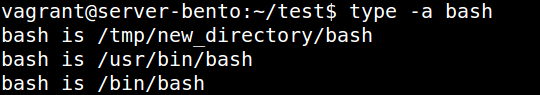

### 3.1. Работа в терминале, лекция 1

1. Ознакомиться с разделами `man bash`, почитать о настройках самого bash:
    * какой переменной можно задать длину журнала `history`, и на какой строчке manual это описывается?

        **Ответ:**
        - HISTSIZE, 705 строка
&nbsp;

    * что делает директива `ignoreboth` в bash?

        **Ответ:**
        - выполняет тоже, что ignorespace и ignoredups
        - ignorespace если строка начинается с пробела, то игнорируется
        - ignoredups если строка уже есть в истории, то она более не включается
&nbsp;

1. В каких сценариях использования применимы скобки `{}` и на какой строчке `man bash` это описано?

    **Ответ:**
    - строка 223
    - { } зарезервированные "слова", должны быть пробелы между командами и скобками
    Помещенные команды внутри скобок вызываются в текущем контексте оболочки.
&nbsp;

1. С учётом ответа на предыдущий вопрос, как создать однократным вызовом `touch` 100000 файлов? Получится ли аналогичным образом создать 300000? Если нет, то почему?
&nbsp;
    **Ответ:**
    - touch {1..100000}.txt
    - Создание 300000 зависит от файловой системы в ext4 возможно, в FAT32 ограничение кол-во файлов на дир-ию - 65,535
&nbsp;


1. В man bash поищите по `/\[\[`. Что делает конструкция `[[ -d /tmp ]]`


    **Ответ:**
     - проверяет существует ли директория /tmp, возвращает 0 или 1
&nbsp;

1. Основываясь на знаниях о просмотре текущих (например, PATH) и установке новых переменных; командах, которые мы рассматривали, добейтесь в выводе type -a bash в виртуальной машине наличия первым пунктом в списке:

	```bash
	bash is /tmp/new_path_directory/bash
	bash is /usr/local/bin/bash
	bash is /bin/bash
	```

	(прочие строки могут отличаться содержимым и порядком)
    В качестве ответа приведите команды, которые позволили вам добиться указанного вывода или соответствующие скриншоты.

    **Ответ:**

    - `nano ~/.bashrc`
    - добавляем `export PATH=/tmp/new_directory:$PATH`
    - `source ~/.bashrc`
    - 

&nbsp;

1. Чем отличается планирование команд с помощью `batch` и `at`?

    **Ответ:**
     - at - исполняет команды в указанное время
     - batch - исполняет команду, когда система нагружена менее, чем 1,5 или менее ,чем указанное значение в вызове batch
